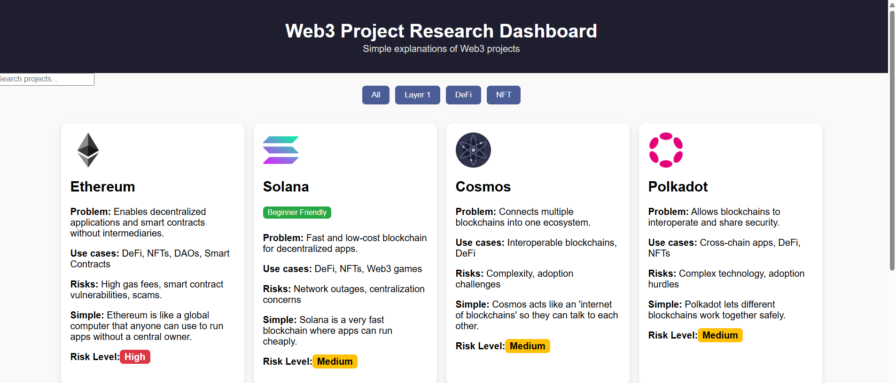
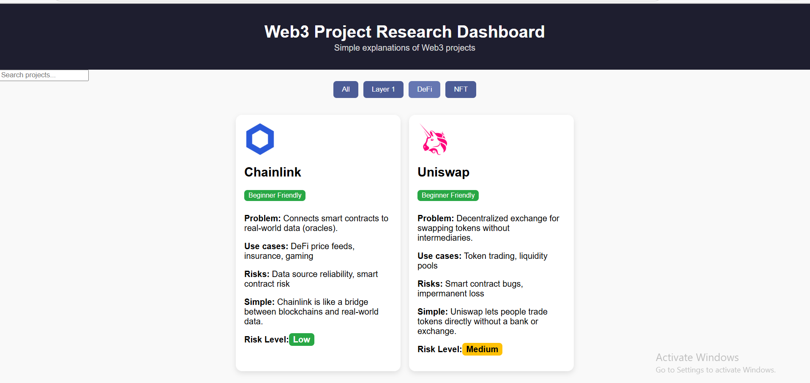
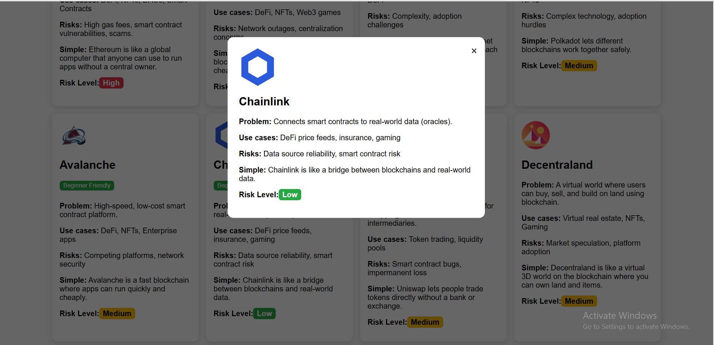

# 🌐 Web3 Research & Trust Dashboard

## 📌 Project Overview
The Web3 Project Research Dashboard is a beginner-friendly web application that provides clear, concise explanations of major Web3 projects such as **Ethereum, Solana, and Cosmos**, including their purpose, adoption challenges, security risks, and key ecosystem information.

It helps users understand:
- What problems each Web3 project solves
- Real-world use cases
- Risks and adoption challenges
- Simple explanations for beginners

This project demonstrates research ability, Web3 ecosystem understanding, and frontend development skills.

---

## 🚀 Features

✅ View major Web3 projects  
✅ Click a project to see details in a modal  
✅ Simple explanations for beginners  
✅ Project risks and adoption challenges  
✅ Clean and responsive UI  

---

## 📸 Screenshots

### Dashboard View

### Project Filter

### Project Modal Popup

---

## 🧠 Technologies Used

- HTML
- CSS
- JavaScript
- React + Vite
- Git & GitHub

---

## 📂 Project Structure
web3-dashboard-react/
│
├─ public/ # Static assets
├─ src/ # React components and app code
│ ├─ components/ # Modal, ProjectCard, etc.
│ ├─ data/ # JSON files with Web3 project info
│ ├─ App.jsx
│ ├─ main.jsx
│ └─ index.css
├─ package.json
├─ vite.config.js
└─ README.md # This file

---

## 🎯 Purpose of the Project

This project was created to:
- Showcase Web3 research skills  
- Demonstrate understanding of blockchain ecosystems  
- Practice React frontend development  
- Build a portfolio project for recruiters  

---

## 🔮 Future Improvements

- Connect to public Web3 APIs for real-time data  
- Add more blockchain projects  
- AI-based project recommendations  
- Security risk analysis dashboard  
- Better filtering and search  

---

## 👩‍💻 Author

**Bhagya Sewmini**  
GitHub: [https://github.com/Techysew](https://github.com/Techysew)  

---

⭐ If you like this project, feel free to star the repository!
